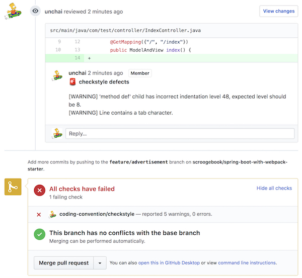

# checkstyle-github-maven-plugin 

[](https://travis-ci.org/unchai/checkstyle-github-maven-plugin)

A maven plug-in that leaves the result of a checkstyle of a project as a comment on github's pull request.



### Requirements

* Maven 3
* Java 8


### Install

```xml
<plugins>
    ...
    <plugin>
        <groupId>com.github.unchai</groupId>
        <artifactId>checkstyle-github-maven-plugin</artifactId>
        <version>LATEST_VERSION</version>
        <configuration>
            <configLocation>[Checkstyle configuration file]</configLocation>
        </configuration>
    </plugin>
    ...
</plugins>
```

### Usage

```shell
$ mvn checkstyle-github:checkstyle-github \
    -Dgithub.endpoint=<github endpoint url> \
    -Dgithub.token=<github oauth token> \
    -Dgithub.repository=<owner/repositoryname> \
    -Dgithub.pullRequest=<pull request id>
```

#### with Jenkinsfile

```
node {
    stage('lint') {
        if (env.CHANGE_ID) {
            withCredentials([[$class: 'StringBinding', credentialsId: 'github-bot', variable: 'GITHUB_ACCESS_TOKEN']]) {
                sh "'${pwd()}/mvnw' clean checkstyle-github:checkstyle-github" +
                   " -Dgithub.token=${GITHUB_ACCESS_TOKEN}" +
                   " -Dgithub.repository=owner/repo" +
                   " -Dgithub.pullRequest=${env.CHANGE_ID}"
            }
        }
    }
}
```

## License

Apache License 2.0 © 2018 [unchai](https://github.com/unchai)